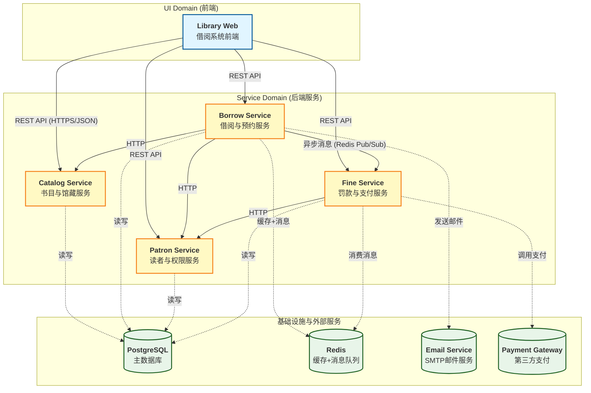

# L2 容器架构 - 在线图书借阅系统

> **文档版本**: v1.0  
> **最后更新**: 2026-04-06  
> **维护者**: H

---

## 1. 容器架构概述

在线图书借阅系统采用 **微服务架构**，按 DDD 限界上下文划分为 4 个主要容器（服务），每个容器对应独立的代码仓库。

**设计原则**：

- 按业务领域（Bounded Context）分离容器
- 每个容器独立部署、独立扩展
- 容器间通过标准化接口通信（HTTP/REST、消息队列）
- 明确安全边界，最小化信任范围

---

## 2. 容器架构图（C4 Level 2）

---

## 3. 容器详细说明

### 3.1 UI Domain – Library Web（前端容器）

**职责**：
- 用户界面渲染（读者端、管理员端）
- 前端路由管理
- 客户端状态管理（借阅车、预约列表）
- 表单验证与API调用封装

**技术栈**：Vue 3 / React（可根据团队选择）

---

### 3.2 Catalog Service（书目与馆藏服务）

**对应 Bounded Context**：Catalog Context

**职责**：
- 书目（Book）CRUD
- 副本（Copy）管理（增删改查、状态变更）
- 图书检索（按书名、作者、ISBN）
- 副本状态查询（可借、已借出等）

**技术栈**：Java 21 + Spring Boot 3.x + Spring Cloud

---

### 3.3 Borrow Service（借阅与预约服务）

**对应 Bounded Context**：Borrowing Context

**职责**：
- 借阅单（Loan）创建、续借、归还
- 预约（Reservation）创建、取消、排队
- 借阅规则校验（数量限制、读者状态）
- 触发逾期罚款生成（通过消息队列）
- 发送借阅/预约相关通知

**技术栈**：Java 21 + Spring Boot 3.x + Spring Cloud

---

### 3.4 Patron Service（读者与权限服务）

**对应 Bounded Context**：Patron Context

**职责**：
- 读者注册、信息维护
- 读者证挂失、补卡、注销
- 读者状态管理（正常、停借、挂失）
- 权限管理（区分读者、管理员）

**技术栈**：Java 21 + Spring Boot 3.x + Spring Cloud

---

### 3.5 Fine Service（罚款与支付服务）

**对应 Bounded Context**：Fine Context

**职责**：
- 罚款单（Fine）生成（由逾期事件触发）
- 罚款金额计算（按规则）
- 对接第三方支付网关，创建支付订单
- 处理支付回调，更新罚款单状态
- 通知 Patron Service 解锁读者

**技术栈**：Python + FastAPI（或 Java）

---

## 4. EdgeID 边界接口定义

### 4.1 EdgeID 注册表

| EdgeID | 源容器 | 目标容器/系统 | 协议 | 业务模块 | L3 文档 | OpenAPI 规范 | 状态 |
|--------|--------|--------------|------|---------|---------|--------------|------|
| **外部接口（E-系列）** |||||||||
| E-LibWeb-01 | Library Web | Payment Gateway | HTTPS | 支付跳转 |  | - | Active |
| E-Borrow-01 | Borrow Service | Email Service | SMTP | 邮件通知 |  | - | Active |
| **内部接口（I-系列）** |||||||||
| I-LibWeb-01 | Library Web | Catalog Service | HTTPS | 图书检索 |  | [openapi-catalog.yaml]() | Active |
| I-LibWeb-02 | Library Web | Borrow Service | HTTPS | 借阅/预约操作 |  | [openapi-borrow.yaml]() | Active |
| I-LibWeb-03 | Library Web | Patron Service | HTTPS | 读者登录/信息 |  | [openapi-patron.yaml]() | Active |
| I-LibWeb-04 | Library Web | Fine Service | HTTPS | 罚款支付 |  | [openapi-fine.yaml]() | Active |
| I-Borrow-01 | Borrow Service | Catalog Service | HTTP | 查询副本状态 |  | [openapi-catalog.yaml]() | Active |
| I-Borrow-02 | Borrow Service | Patron Service | HTTP | 验证读者状态 |  | [openapi-patron.yaml]() | Active |
| I-Borrow-03 | Borrow Service | Fine Service | Redis Pub/Sub | 创建罚款单 |  | - | Active |
| I-Fine-01 | Fine Service | Patron Service | HTTP | 解锁读者 |  | [openapi-patron.yaml]() | Active |

**列说明**：
- **EdgeID**：边界接口唯一标识符
- **源容器**：发起调用的容器
- **目标容器/系统**：接收调用的容器或外部系统
- **协议**：通信协议（HTTPS、HTTP、Redis Pub/Sub、SMTP）
- **业务模块**：接口覆盖的业务功能范围
- **L3 文档**：对应的 L3 简版文档路径（向下追溯到组件级）
- **OpenAPI 规范**：对应的 API 规范文档路径（"-" 表示非 HTTP/gRPC 接口）
- **状态**：Active（活跃）、Deprecated（已废弃）

---

### 4.2 外部接口详细定义

#### E-LibWeb-01: Library Web → Payment Gateway

**架构意图**：
- 读者支付逾期罚款时，前端直接跳转到第三方支付网关（或通过后端获取支付链接）。  
  这样做可以避免后端处理敏感支付凭证，减少 PCI-DSS 合规范围。

**收益**：
- 安全隔离支付细节。
- 支付网关提供成熟的 UI 和退款能力。

---

#### E-Borrow-01: Borrow Service → Email Service

**架构意图**：
- 借阅成功、归还提醒、预约到书等事件需要发送邮件。使用第三方 SMTP 服务（如 SendGrid、阿里云邮件）降低运维成本。

**收益**：
- 提高送达率，自动处理退信。

---

### 4.3 内部接口详细定义

#### I-LibWeb-01: Library Web → Catalog Service（图书检索）

**架构意图**：
- 读者在界面检索图书，支持分页、过滤。Catalog Service 负责维护书目索引，可引入 Elasticsearch 增强检索能力（未来版本）。

---

#### I-LibWeb-02: Library Web → Borrow Service（借阅/预约操作）

**架构意图**：
- 处理借书、还书、续借、预约等核心业务请求。Borrow Service 会校验规则并调用其他服务。

---

#### I-LibWeb-03: Library Web → Patron Service（读者登录/信息）

**架构意图**：
- 统一认证入口。读者登录后获得 JWT，后续请求携带 Token，各服务验证 Token 并获取读者信息。

---

#### I-Borrow-01: Borrow Service → Catalog Service（查询副本状态）

**架构意图**：
- 借书时需要检查副本是否 Available；还书时需要通知 Catalog Service 更新副本状态。  
  采用 HTTP 同步调用，保证数据一致性（必要时引入补偿事务）。

---

#### I-Borrow-02: Borrow Service → Patron Service（验证读者状态）

**架构意图**：
- 借书前验证读者是否为 Active 状态，是否超过最大借阅数量。Patron Service 提供查询接口。

---

#### I-Borrow-03: Borrow Service → Fine Service（创建罚款单）

**架构意图**：
- 当 Loan 归还时，如果逾期，Borrow Service 发送异步消息（Redis Pub/Sub）到 Fine Service，Fine Service 生成罚款单。  
  异步解耦，避免借还流程被罚款计算阻塞。

---

#### I-Fine-01: Fine Service → Patron Service（解锁读者）

**架构意图**：
- 读者支付所有罚款后，Fine Service 调用 Patron Service 的接口，将读者状态从 Suspended 恢复为 Active。

---

## 5. 补充说明

### 5.1 数据存储策略

- 每个服务拥有自己的数据库 Schema（逻辑隔离），不跨库直接访问。
- 最终一致性场景（如罚款单生成）使用消息队列。

### 5.2 安全与认证

- 所有服务间调用均需携带 JWT（通过 API Gateway 或拦截器）。
- 敏感操作（支付回调）需验签。

### 5.3 部署与扩展

- Catalog Service 和 Patron Service 读多写少，可水平扩展。
- Borrow Service 业务复杂，需根据借阅流量单独扩容。
