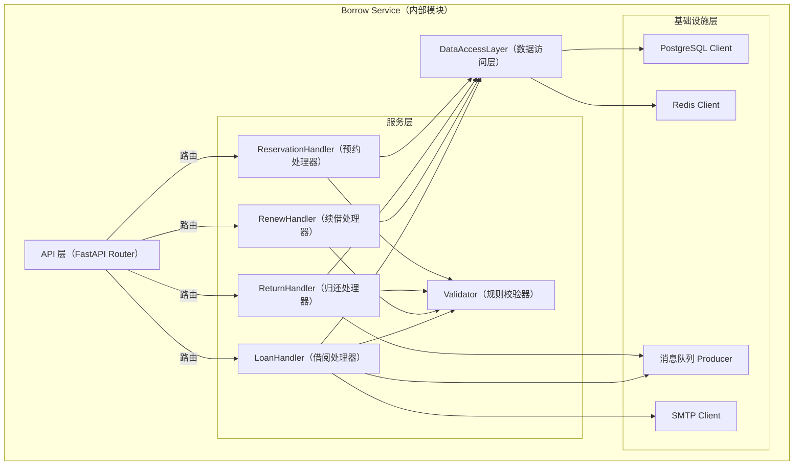
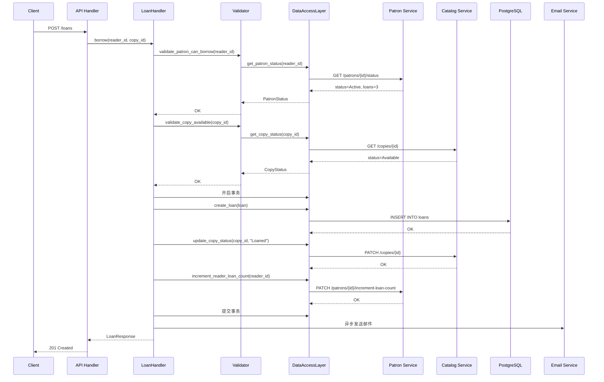

# Borrow Service — L3 详细设计

> **对应简版**：[L3_BorrowService_brief_v1.0.md](../../../train-specs/docs/l3/borrow/L3_BorrowService_brief_v1.0.md)  
> **对应用例**：
> - [UC-001 读者借阅图书](../../../train-specs/docs/usecase/UC-001-reader-borrow-book.md)
> - [UC-002 读者续借图书](../../../train-specs/docs/usecase/UC-002-reader-renew-book.md)
> - [UC-003 读者归还图书](../../../train-specs/docs/usecase/UC-003-reader-return-book.md)
> - [UC-004 读者预约图书](../../../train-specs/docs/usecase/UC-004-reader-reserve-book.md)

---

## 1. 元信息

- **系统**：在线图书借阅系统
- **容器名称**：Borrow Service
- **版本**：v1.0
- **最后更新**：2026-04-10
- **状态**：Draft  
- **作者/Owner**：Architecture Team
- **运行时环境**：Java 21 + Spring Boot 3.x (注：本 L3 详细设计使用 Python 伪代码表示核心逻辑)
- **上游文档**：  
  * L2：[L2-container-online-library-system.md](../../../train-specs/docs/l2/L2-container-online-library-system.md)
  * L3 简版：[L3_BorrowService_brief_v1.0.md](../../../train-specs/docs/l3/borrow/L3_BorrowService_brief_v1.0.md)
- **相关契约 / Schema**：  
  * OpenAPI：[openapi-borrow.yaml](../../../train-specs/docs/openapi/borrow/openapi-borrow.yaml)

---

## 2. 设计目标与约束

### 2.1 设计目标

- **借阅流程的强一致性**  
  借阅操作涉及读者状态、副本状态、借阅单创建等多个数据变更，需通过数据库事务保证强一致性，避免超借或状态不一致。

- **异步解耦罚款生成**  
  归还图书时若发生逾期，通过消息队列异步触发罚款单生成，避免阻塞归还主流程，同时保证最终一致性。

- **规则集中管理**  
  借阅规则（如最大借阅数量、借阅期限、续借次数）由 Borrow Service 统一管理，避免分散到多个服务导致规则不一致。

### 2.2 非目标

- **不存储图书目录与副本元数据**  
  图书基本信息、副本条码等由 Catalog Service 管理，Borrow Service 仅通过 API 查询和更新副本状态。

- **不处理读者档案与权限**  
  读者注册、状态（停借/挂失）、借阅数量统计由 Patron Service 管理，Borrow Service 仅调用其接口校验和更新。

- **不处理罚款计算与支付**  
  逾期后仅发送事件，由 Fine Service 负责罚款单生成、计算和支付回调。

- **不直接发送通知邮件**  
  借阅成功邮件等通知由 Borrow Service 调用 Email Service 完成，不自行实现重试和模板管理。

---

## 3. 内部架构总览

### 3.1 组件视图


  

---
**说明：**
- API 层：处理 HTTP 请求，解析 JWT Token，路由到对应处理器。

- 服务层：

  - LoanHandler：处理借阅请求，校验规则，创建借阅单，更新副本状态和读者计数，发送邮件。
  - RenewHandler：处理续借请求，校验是否逾期、续借次数。
  - ReturnHandler：处理归还请求，更新借阅单状态和副本状态，若逾期则发送消息到罚款服务。
  - ReservationHandler：处理预约、取消预约请求，管理预约排队。
  - Validator：封装所有规则校验（读者状态、借阅数量、副本状态、预约条件等），保持可复用。：封装对本地数据库（借阅单、预约单）的 CRUD 操作。
- 数据访问层：封装对 PostgreSQL 的操作，包括借阅单、预约单的 CRUD，以及调用外部服务（Catalog/Patron）的客户端。
- 基础设施层：
  - PostgreSQL Client：数据库连接池，事务管理。
  - Redis Client：缓存读者当前借阅计数、副本状态（可选）。
  - 消息队列 Producer：发送逾期事件到 Fine Service。
  - SMTP Client：发送借阅成功邮件

### 3.2 进程模型
- Borrow Service 采用 单进程 + 异步 I/O 模型（Python + FastAPI + async/await）：
  - 主进程运行 FastAPI 应用，处理所有 HTTP 请求。
  - 每个请求在一个独立协程中处理，利用异步 I/O 调用外部服务（Patron/Catalog）。
  - 数据库操作使用异步驱动（如 asyncpg），避免阻塞。
- 关键配置：
  - Worker 数量：由 Kubernetes 控制，通常为 CPU 核心数。
  - 数据库连接池：每个 Worker 维护一个连接池（大小 20）。
  - 请求超时：全局 10s，防止外部服务超时拖垮自身。

### 4. 内部数据模型（Informative）
#### 4.1 核心实体
4.1.1 Loan（借阅单）
```python
from datetime import date, datetime
from uuid import UUID

class Loan:
    id: UUID
    reader_id: str
    copy_id: str
    loan_date: date
    due_date: date
    return_date: date | None
    status: str  # 'Active', 'Overdue', 'Returned', 'Closed'
    renewal_count: int
    created_at: datetime
    updated_at: datetime
```
#### 4.1.2 Reservation（预约单）
```python
class Reservation:
    id: UUID
    reader_id: str
    book_id: str          # 书目ID，而非具体副本
    status: str           # 'Pending', 'Fulfilled', 'Cancelled', 'Expired'
    created_at: datetime
    expires_at: datetime | None   # 预约满足后通知读者的有效期
    fulfilled_at: datetime | None
```

#### 4.1.3 Copy（副本状态，从 Catalog Service 获取的视图）
```python
class CopyStatus:
    copy_id: str
    book_id: str
    status: str           # 'Available', 'Loaned', 'Reserved', 'Lost', 'Decommissioned'
    loan_id: UUID | None  # 若已借出，关联的借阅单ID
```
#### 4.1.4 Patron（读者状态，从 Patron Service 获取的视图）
```python
class PatronStatus:
    reader_id: str
    status: str           # 'Active', 'Suspended', 'LostCard', 'Closed'
    current_loans: int    # 当前借阅数量
    max_loans: int        # 最大借阅数量（固定5）
```
### 4.2 借阅规则配置（内存/环境变量）
```python
class BorrowPolicy:
    max_loans_per_reader: int = 5
    loan_duration_days: int = 30
    max_renewal_count: int = 1
    reservation_expiry_hours: int = 48
```
## 5. 内部组件设计
### 5.1 API Handler（以借阅为例）
```python
# routes/loans.py
from fastapi import APIRouter, Depends, HTTPException
from uuid import UUID

router = APIRouter(prefix="/loans", tags=["Loan"])

@router.post("/", status_code=201)
async def borrow_book(
    request: BorrowRequest,
    reader_id: str = Depends(get_current_reader_id),  # 从 JWT 解析
    loan_handler: LoanHandler = Depends()
):
    try:
        result = await loan_handler.borrow(reader_id, request.copy_id)
        return result
    except BusinessRuleViolation as e:
        raise HTTPException(status_code=e.http_status, detail=e.message, headers={"X-Error-Code": e.code})
    except ExternalServiceError as e:
        raise HTTPException(status_code=503, detail="Service unavailable")
```
### 5.2 LoanHandler（借阅处理器）
```python
class LoanHandler:
    def __init__(self, validator: Validator, dal: DataAccessLayer, msg_producer: MessageProducer, email_client: EmailClient):
        self.validator = validator
        self.dal = dal
        self.msg_producer = msg_producer
        self.email_client = email_client

    async def borrow(self, reader_id: str, copy_id: str) -> LoanResponse:
        # 1. 校验读者状态和借阅数量（调用 Patron Service）
        patron = await self.validator.validate_patron_can_borrow(reader_id)
        # 2. 校验副本状态（调用 Catalog Service）
        copy = await self.validator.validate_copy_available(copy_id)
        
        # 3. 开启数据库事务
        async with self.dal.transaction():
            # 创建借阅单
            loan = Loan(
                reader_id=reader_id,
                copy_id=copy_id,
                loan_date=date.today(),
                due_date=date.today() + timedelta(days=30),
                status="Active",
                renewal_count=0
            )
            loan = await self.dal.create_loan(loan)
            
            # 更新副本状态为 Loaned（调用 Catalog Service）
            await self.dal.update_copy_status(copy_id, "Loaned", loan.id)
            
            # 增加读者当前借阅计数（调用 Patron Service）
            await self.dal.increment_reader_loan_count(reader_id)
        
        # 4. 异步发送邮件（不阻塞主流程）
        asyncio.create_task(self.email_client.send_borrow_success_email(patron.email, copy.book_title, loan.due_date))
        
        return LoanResponse.from_entity(loan)
```
### 5.3 Validator（规则校验器）
```python
class Validator:
    async def validate_patron_can_borrow(self, reader_id: str) -> PatronStatus:
        patron = await self.dal.get_patron_status(reader_id)
        if patron.status != "Active":
            raise BusinessRuleViolation("PATRON_SUSPENDED", "Patron is suspended", 403)
        if patron.current_loans >= patron.max_loans:
            raise BusinessRuleViolation("LOAN_LIMIT_EXCEEDED", f"Max loans reached ({patron.max_loans})", 403)
        return patron
    
    async def validate_copy_available(self, copy_id: str) -> CopyStatus:
        copy = await self.dal.get_copy_status(copy_id)
        if copy.status != "Available":
            raise BusinessRuleViolation("COPY_NOT_AVAILABLE", "Copy is not available", 409)
        return copy
    
    async def validate_renew(self, loan_id: str, reader_id: str) -> Loan:
        loan = await self.dal.get_loan(loan_id)
        if loan.reader_id != reader_id:
            raise BusinessRuleViolation("LOAN_NOT_OWNED", "Not your loan", 403)
        if loan.status not in ("Active", "Overdue"):
            raise BusinessRuleViolation("RENEW_NOT_ALLOWED", "Loan not active", 400)
        if loan.renewal_count >= max_renewal_count:
            raise BusinessRuleViolation("RENEW_LIMIT_EXCEEDED", "Renewal limit reached", 400)
        if date.today() > loan.due_date:
            raise BusinessRuleViolation("RENEW_NOT_ALLOWED_OVERDUE", "Cannot renew overdue loan", 400)
        return loan
```
### 5.4 DataAccessLayer（数据访问层）
```python
class DataAccessLayer:
    def __init__(self, db_pool, catalog_client, patron_client):
        self.db = db_pool
        self.catalog = catalog_client
        self.patron = patron_client
    
    async def create_loan(self, loan: Loan) -> Loan:
        async with self.db.acquire() as conn:
            row = await conn.fetchrow(
                "INSERT INTO loans (id, reader_id, copy_id, loan_date, due_date, status, renewal_count) VALUES ($1, $2, $3, $4, $5, $6, $7) RETURNING *",
                loan.id, loan.reader_id, loan.copy_id, loan.loan_date, loan.due_date, loan.status, loan.renewal_count
            )
            return self._row_to_loan(row)
    
    async def get_loan(self, loan_id: str) -> Loan | None:
        async with self.db.acquire() as conn:
            row = await conn.fetchrow("SELECT * FROM loans WHERE id = $1", loan_id)
            return self._row_to_loan(row) if row else None
    
    async def update_copy_status(self, copy_id: str, status: str, loan_id: str = None):
        # 调用 Catalog Service 的 PATCH 接口
        await self.catalog.patch(f"/copies/{copy_id}", json={"status": status, "loan_id": loan_id})
    
    async def increment_reader_loan_count(self, reader_id: str):
        await self.patron.patch(f"/patrons/{reader_id}/increment-loan-count")
    
    async def get_patron_status(self, reader_id: str) -> PatronStatus:
        resp = await self.patron.get(f"/patrons/{reader_id}/status")
        return PatronStatus(**resp.json())
```
### 5.5 归还处理器与异步消息
```python
class ReturnHandler:
    async def return_loan(self, loan_id: str) -> ReturnResponse:
        loan = await self.dal.get_loan(loan_id)
        if loan.status in ("Returned", "Closed"):
            raise BusinessRuleViolation("ALREADY_RETURNED", "Loan already returned", 400)
        
        overdue_days = max(0, (date.today() - loan.due_date).days)
        
        async with self.dal.transaction():
            # 更新借阅单
            loan.return_date = date.today()
            loan.status = "Returned"
            await self.dal.update_loan(loan)
            # 更新副本状态为 Available（若有预约则后续由预约队列处理）
            await self.dal.update_copy_status(loan.copy_id, "Available")
            # 减少读者借阅计数
            await self.dal.decrement_reader_loan_count(loan.reader_id)
        
        # 如果逾期，发送异步消息到 Fine Service 生成罚款单
        if overdue_days > 0:
            event = OverdueEvent(
                loan_id=loan.id,
                reader_id=loan.reader_id,
                copy_id=loan.copy_id,
                overdue_days=overdue_days,
                due_date=loan.due_date
            )
            await self.msg_producer.publish("loan.overdue", event.json())
        
        return ReturnResponse(overdue_days=overdue_days)
```
## 6. 关键流程详解
### 6.1 借阅图书完整时序图

### 6.2 错误处理流程
#### 6.2.1：读者停借
```python
# 在 Validator.validate_patron_can_borrow 中
if patron.status != "Active":
    raise BusinessRuleViolation(
        code="PATRON_SUSPENDED",
        message="Patron account is suspended due to overdue fines",
        http_status=403,
        details={"reason": patron.suspend_reason}
    )
```
#### 6.2.2：并发借阅冲突
```python
# 在 LoanHandler.borrow 中，更新副本状态时使用乐观锁
try:
    await self.dal.update_copy_status(copy_id, "Loaned", loan.id, expected_previous_status="Available")
except ConcurrentUpdateError:
    raise BusinessRuleViolation("CONCURRENT_LOAN_CONFLICT", "Another reader borrowed this copy just now", 409)
```
## 7 可靠性、容错与配置
### 7.1 关键配置项
环境变量|	默认值	|说明
|---|---:|---|
|BORROW_DB_HOST|	localhost|	PostgreSQL 主机|
|BORROW_DB_PORT	|5432	|PostgreSQL 端口|
|BORROW_DB_NAME	|library|	数据库名|
|BORROW_DB_POOL_SIZE	|20	|数据库连接池大小|
|BORROW_LOAN_MAX_PER_READER	|5	|最大借阅数量|
|BORROW_LOAN_DURATION_DAYS | 30	|默认借阅期限（天）|
|BORROW_MAX_RENEWAL_COUNT	| 1	|最大续借次数|
|BORROW_RESERVATION_EXPIRY_HOURS	| 48	|预约到书后保留时长（小时）|
|BORROW_SERVICE_PORT	| 8080	|服务监听端口|
|BORROW_LOG_LEVEL |	INFO |日志级别|
|BORROW_REQUEST_TIMEOUT |	10	| 请求超时（秒）|
|REPORT_REDIS_HOST	|localhost|	Redis 主机（用于缓存读取）|
|REPORT_REDIS_PORT	|6379|	Redis 端口|
|REPORT_SERVICE_PORT	|8080|	服务监听端口|
|REPORT_LOG_LEVEL	|INFO	|日志级别|
|REPORT_REQUEST_TIMEOUT|	30|	请求超时（秒）|
---

### 7.2 容错策略
- 数据库故障：
  - 连接池自动重试（最多3次，指数退避）
  - 健康检查失败时返回 503，K8s 重启 Pod。

- 外部服务不可用（Patron/Catalog）：
  - 使用断路器模式（如 tenacity 库），熔断后快速失败。
  - 降级：若 Catalog 不可用，借阅请求直接返回 503。

- 消息队列故障：
  - 逾期事件无法发送时，记录到本地死信表，后台定时重试。

- 邮件服务故障：
  - 仅记录错误和告警，不中断借阅主流程。
## 8 Observability：Metrics & 日志
### 8.1 日志规范
```json
{
  "timestamp": "2026-04-10T10:30:00Z",
  "level": "INFO",
  "service": "borrow-service",
  "trace_id": "550e8400-e29b-41d4-a716-446655440000",
  "span_id": "abc123",
  "request_id": "req-789",
  "endpoint": "POST /loans",
  "reader_id": "reader-456",
  "copy_id": "copy-123",
  "duration_ms": 245,
  "message": "Loan created successfully",
  "loan_id": "loan-999"
}
```
关键日志点：
- 请求开始/结束（含参数、耗时）。
- 外部服务调用（Patron/Catalog）的请求和响应（采样记录）。
- 业务规则拒绝（记录规则类型和输入）。
- 异步消息发送成功/失败。

### 8.2 关键 Metrics
指标名	| 类型	| 标签 |	说明|
|---|---|---|---|
|borrow_loans_total |	Counter |	result（success/failure） |	借阅请求总数|
|borrow_loan_duration_seconds |	Histogram | 	- 	|借阅处理耗时分布|
|borrow_external_calls_total |	Counter |	service（patron/catalog）, status |	外部服务调用计数|
|borrow_overdue_events_total |	Counter |	 - 	|生成的逾期事件数|
|borrow_queue_size |	Gauge |	queue_name	|消息队列积压数量|


---
**文档结束**
