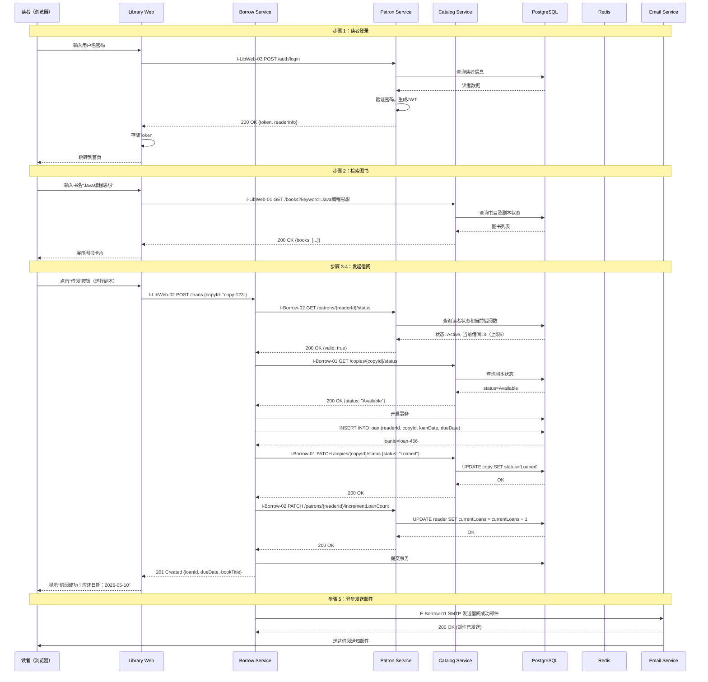

# UC-001：读者借阅图书

> **版本**：v1.0
> **对齐 L2 架构**：L2-container-online-library-system.md
> **最后更新**：2026-04-10
> **状态**：Draft
> **用途**：开发流程培训示例

---

## 概述

**目的**：演示读者从登录到完成图书借阅的完整流程，包括 **登录 → 检索图书 → 查看副本状态 → 发起借阅 → 校验规则 → 创建借阅单 → 更新副本状态 → 发送通知**。

**范围**：

- ✅ 读者登录认证
- ✅ 图书检索（按书名、作者、ISBN）
- ✅ 查看图书副本状态（可借/已借出）
- ✅ 发起借阅请求
- ✅ 借阅规则校验（读者状态、借阅数量限制）
- ✅ 创建借阅单并更新副本状态
- ✅ 发送借阅成功邮件通知

**业务价值**：

- 读者可在线完成借阅，无需到馆办理
- 实时查看图书可借状态，避免白跑
- 自动化借阅流程，提升图书馆服务效率

---

## 1. 用例元数据

| 项目 | 内容 |
|------|------|
| **ID** | UC-001-reader-borrow-book |
| **优先级** | P0（最高优先级，核心业务） |
| **业务价值** | ✦✦✦✦✦（图书馆最核心功能） |
| **对齐架构** | L2-container-online-library-system.md（L2 容器架构） |
| **依赖用例** | 无（独立用例） |
| **涉及域数** | 4个（UI、Catalog、Borrow、Patron） |
| **培训重点** | 多服务协作、规则校验、事务一致性 |

---

## 2. 参与容器及其职责

参考 L2 架构文档第 3 节，本用例涉及以下容器：

### UI Domain（用户界面）

- **Library Web**
  - 职责：提供图书检索界面，展示借阅表单，显示借阅结果
  - 参考：L2 架构 3.1 节
  - 技术栈：Vue 3 + TypeScript + Element Plus

### Service Domain（后端服务）

- **Catalog Service**
  - 职责：图书检索、副本状态查询、更新副本状态
  - 参考：L2 架构 3.2 节
  - 技术栈：Java + Spring Boot

- **Borrow Service**
  - 职责：借阅规则校验、创建借阅单、协调借阅流程
  - 参考：L2 架构 3.3 节
  - 技术栈：Java + Spring Boot

- **Patron Service**
  - 职责：读者状态校验、借阅数量校验
  - 参考：L2 架构 3.4 节
  - 技术栈：Java + Spring Boot

### 基础设施

- **PostgreSQL**
  - 职责：存储读者信息、图书副本信息、借阅单
- **Redis**
  - 职责：缓存图书检索结果、读者借阅计数
- **Email Service**
  - 职责：发送借阅成功通知邮件

---

## 3. 前置 / 后置条件

### 前置条件

1. **用户认证**
   - 读者已登录，Library Web 持有有效的 JWT Token
   - Token 包含读者ID和角色信息（ROLE_READER）

2. **图书存在**
   - 目标图书在系统中存在，且有至少一个副本状态为 Available

3. **读者状态正常**
   - 读者状态为 Active（正常）
   - 当前借阅数量未达到上限（例如上限 5 本）

4. **服务可用**
   - Catalog Service、Borrow Service、Patron Service 正常运行
   - PostgreSQL 和 Redis 连接正常

### 后置条件（成功）

1. **借阅单创建成功**
   - 数据库新增一条借阅单记录（Loan），状态为 Active
   - 借阅单包含：读者ID、副本ID、借阅日期、应还日期（默认 30 天后）

2. **副本状态更新**
   - 对应副本状态从 Available 变为 Loaned

3. **读者借阅计数增加**
   - 读者的当前借阅数量 +1（存储在 Patron Service 或 Redis）

4. **邮件通知发送**
   - 读者收到借阅成功通知邮件（包含书名、应还日期）

---

## 4. 主成功流程（端到端）

本节描述从读者登录到完成借阅的完整流程，包含 **5 个主要步骤**。

### 步骤 1：读者登录

**EdgeID**: I-LibWeb-03

**操作**：读者在 Library Web 输入用户名和密码登录

**Patron Service 处理**：

1. 验证用户名和密码（BCrypt 哈希对比）
2. 生成 JWT Token（有效期 2 小时）
3. 返回 Token 和读者基本信息

**前端处理**：

- 将 Token 存储到 localStorage
- 跳转到首页（图书检索）

**失败处理**：

- `401 Unauthorized`：用户名或密码错误
- `423 Locked`：账号已锁定（多次登录失败或逾期未还书）

**参考文档**：

- L2 架构 4.3 节（I-LibWeb-03）
- OpenAPI 规范：`docs/openapi/patron-service.yaml#/auth/login`

---

### 步骤 2：检索图书

**EdgeID**: I-LibWeb-01

**操作**：读者在检索框输入书名、作者或 ISBN，点击搜索

**Catalog Service 处理**：

1. 校验 JWT Token（调用 Patron Service 验证）
2. 根据关键字检索书目（Book）和副本（Copy）信息
3. 返回图书列表，每条包含：
   - 书目信息（书名、作者、出版社、封面图）
   - 所有副本的状态（可借数量 / 总副本数）
4. 结果可缓存到 Redis（有效期 10 分钟）

**前端展示**：

- 以卡片列表展示图书
- 每本书显示“可借”或“已借完”标签
- 点击“详情”可查看所有副本的具体状态

**失败处理**：

- `400 Bad Request`：搜索关键字为空或过短
- `500 Internal Server Error`：服务错误

**参考文档**：

- L2 架构 4.3 节（I-LibWeb-01）
- OpenAPI 规范：`docs/openapi/catalog-service.yaml#/books/search`

---

### 步骤 3：发起借阅请求

**EdgeID**: I-LibWeb-02

**操作**：读者在图书详情页点击“借阅”按钮，选择要借阅的具体副本（如有多个副本）

**Borrow Service 处理**：

1. 验证 JWT Token（调用 Patron Service）
2. 从 Token 提取 readerId
3. 调用 Patron Service 检查读者状态和借阅数量
4. 调用 Catalog Service 检查目标副本状态是否为 Available
5. 创建借阅单（Loan），状态 Active
6. 调用 Catalog Service 将副本状态更新为 Loaned
7. 调用 Patron Service 增加读者当前借阅计数
8. 异步触发邮件通知（通过消息队列或直接调用邮件服务）

**返回结果**：

- 借阅成功，返回借阅单信息（借阅ID、书名、应还日期）

**失败处理**：

- `400 Bad Request`：副本已借出或不存在
- `403 Forbidden`：读者状态不正常（停借、挂失）或借阅数量已达上限
- `409 Conflict`：并发借阅冲突（另一读者刚借走同一副本）

**参考文档**：

- L2 架构 4.3 节（I-LibWeb-02、I-Borrow-01、I-Borrow-02）
- OpenAPI 规范：`docs/openapi/borrow-service.yaml#/loans`

---

### 步骤 4：前端展示借阅结果

**操作**：Library Web 接收到成功响应后更新界面

**前端处理**：

1. 显示成功提示：“借阅成功！《书名》应还日期：YYYY-MM-DD”
2. 更新当前页面的副本状态为“已借出”
3. 可选：自动刷新“我的借阅”页面（如果已打开）

**失败处理**：

- 若返回 403（数量超限），提示“您已达到最大借阅数量（5本），请先归还”
- 若返回 409（冲突），提示“该图书已被借走，请稍后再试”

---

### 步骤 5：发送邮件通知（异步）

**EdgeID**: E-Borrow-01

**操作**：Borrow Service 通过 SMTP 发送借阅成功邮件

**Email Service 处理**：

1. 接收邮件请求（包含读者邮箱、书名、应还日期）
2. 调用第三方 SMTP 服务（如 SendGrid、阿里云邮件）
3. 发送邮件，标题：“【图书馆】借阅成功通知”

**失败处理**：

- 邮件服务不可用时不阻塞主流程，仅记录错误日志
- 重试 3 次，间隔 5 秒
- 最终失败时，在系统后台生成告警，管理员可手动补发

**参考文档**：

- L2 架构 4.2 节（E-Borrow-01）

---

## 5. 端到端时序图

